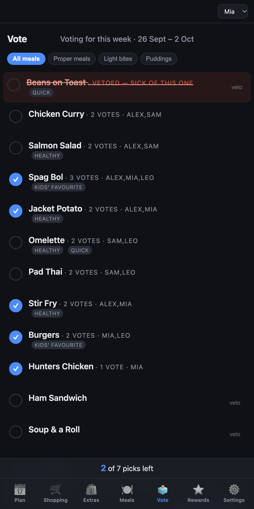
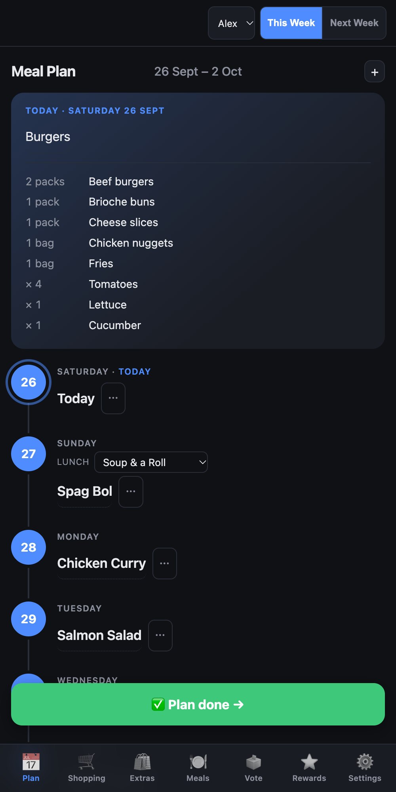
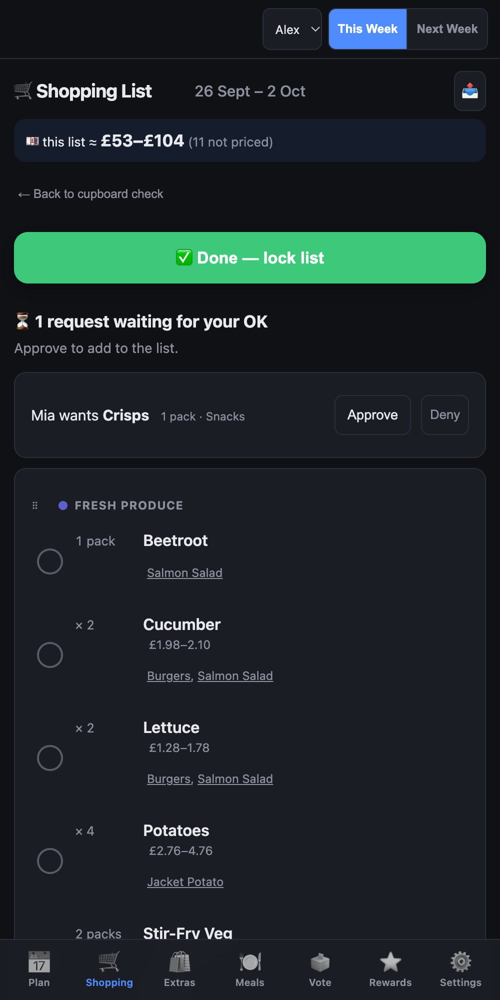
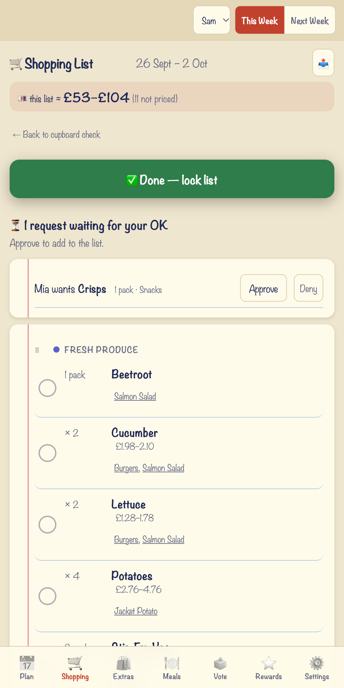
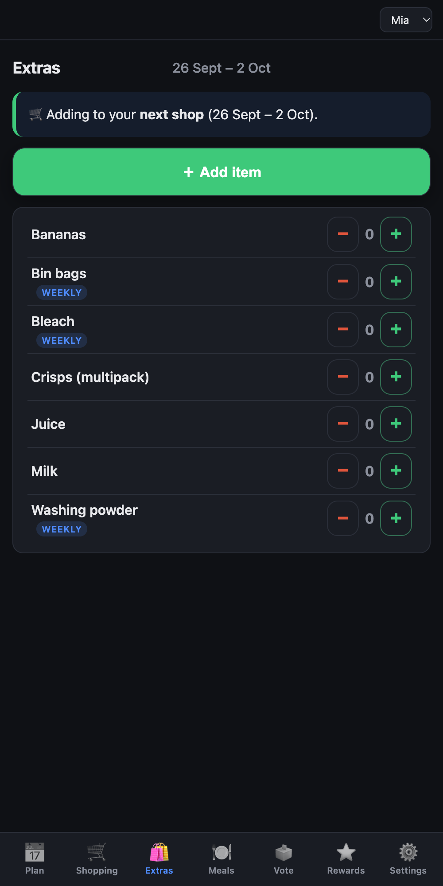
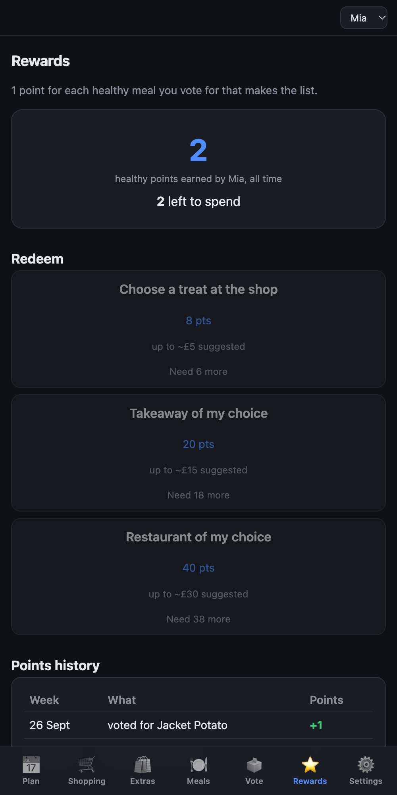
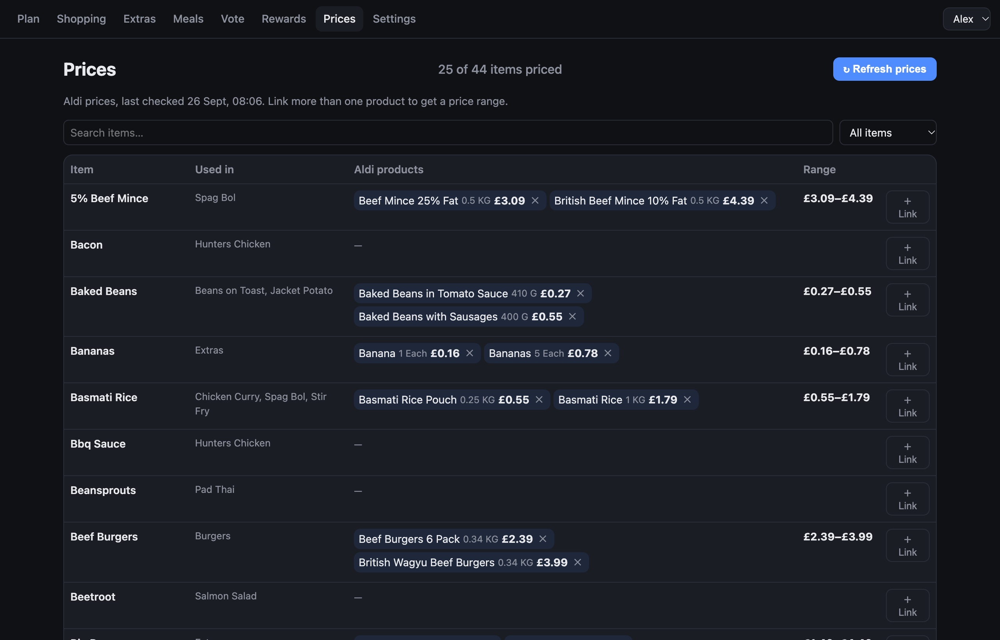

# Family Meal Planner

A self-hosted weekly meal planner for a family. Everyone votes on dinners from their own phone,
parents turn the winners into a plan, and the app builds the shopping list, checks the cupboards
first, and estimates what the shop will cost from real supermarket prices. Kids earn points for
voting healthy, which a parent can swap for a treat.

**Python standard library + SQLite. No pip packages, no npm, no build step, no cloud, no AI.**
One file of server code, one of JavaScript, one of CSS — nothing to rot.

<p>
  
  
  
  
</p>

## How a week works

1. **Vote.** Everyone ticks the meals they want (7 picks each). Parents' votes outrank any number
   of children's votes; children's votes decide the order among meals the parents agree on. Each
   person gets one **veto** — but not on a meal someone has already voted for.
2. **Plan.** A parent finalises the winners and drops each onto a day, lunch or dinner.
3. **Cupboard check.** Before leaving the house, tick off what you've already got.
4. **Shop.** The list is grouped by aisle in your store's order, with a price range per item and
   for the whole shop. It keeps working with no signal and syncs ticks when you're back online.
5. **Lock the list.** Marks the shop done, records what it actually cost, and opens voting for
   next week.

## Features

| | |
|---|---|
| **Voting** | Parent-weighted ranking, configurable vetoes, live "picks left" counter |
| **Plan** | Timeline of the week, lunch and dinner per day, one ⋯ menu per day to change, move or clear |
| **Shopping** | Aisle-ordered, per-store aisle order, cupboard check, offline ticks, lock when done |
| **Extras** | Non-meal items (milk, bin bags). Kids can ask for up to 3 of anything — a parent approves. Items tagged *grown-ups only* (bleach, razors…) are hidden from kids |
| **Prices** | Link each ingredient to one or more Aldi UK products → a price range, whole packs, refreshed on demand |
| **Rewards** | 1 point per healthy meal a child voted for that made the list; parents redeem treats, or swap a day's dinner for a takeaway |
| **Family** | Own sign-in per person, page access per person, per-person themes (plain, fun, notepad in four colours), live sync between phones |
| **History** | Past weeks, full points history, and who asked for which extras |

<p>
  
  
</p>


## Run it

```bash
python3 seed.py     # first time only: a starter meal library
python3 server.py   # http://localhost:8080
```

The first visit creates your account (you become the admin). Add everyone else from
**Settings → Family**: each person gets a username from their name, and you give them a temporary
password with **🔑 Set a temporary password**. They choose their own the first time they sign in.

Locked out? From the server's shell: `python3 server.py set-password <username>` (leave the
password blank to get a temporary one).
Use `MEALPLAN_DB=/path/to/mealplan.db` and `PORT=8080` to move the database or port.

Or in Docker:

```bash
docker compose up -d
```

Add it to your phone's home screen for a full-screen app with a bottom tab bar.

### Put it behind a reverse proxy

Run it behind any reverse proxy that provides HTTPS (Caddy, Nginx Proxy Manager, Traefik, nginx).
HTTPS is required: sign-in cookies are marked `Secure`, and browsers only install it as an app and
allow notifications over HTTPS. `localhost` is the exception, for trying it out. Caddy example:

```
meals.example.com {
	reverse_proxy 127.0.0.1:8080
}
```

In Nginx Proxy Manager, add a proxy host to the app's port with a Let's Encrypt certificate.
No password gate is needed in the proxy; the app has its own sign-in. Make sure the app's port is
only reachable through the proxy (bind or firewall it), and that the proxy sends `X-Real-IP` or
`X-Forwarded-For` (both do by default), which the app trusts only from a proxy on the same machine.

### Notifications

Each person can turn on push notifications per device under **Settings → Notifications**, and
switch individual kinds off: voting opens, a reminder at 6pm if a child hasn't voted after a day,
the week's meals being set, and (parents only) a child asking for an extra. The app needs to be
installed and served over HTTPS (see above).

Push needs one extra package, `cryptography` (`pip install cryptography`, or
`apt install python3-cryptography`); the Docker image includes it. Without it everything else
works and notifications simply show as unavailable. Set `PUSH_CONTACT=mailto:you@example.com`,
because Apple's push service rejects a placeholder contact. Notification text is end-to-end
encrypted to each device, so the browser's push service (Google or Apple) only relays opaque data.

## Privacy and the network

- **Sign-in:** everyone has their own username and password, hashed with scrypt (PBKDF2 where
  scrypt isn't available). Sessions are random tokens in an `HttpOnly`, `Secure`, `SameSite=Lax`
  cookie, stored only as a hash, lasting 180 days of use. Before sign-in, only the login form and
  static files are reachable. Five wrong passwords lock that account for 15 minutes, and each IP
  gets 20 attempts per 15 minutes. Every failure returns HTTP 401, so a proxy running CrowdSec
  (`http-generic-bf`) or fail2ban can ban the address. Children can only ever act as themselves;
  the server takes identity from the session, never from the request.
- Fine on the open internet behind an HTTPS proxy, but **never expose the app port directly.**
- The server makes **no outbound requests** except push notifications you've turned on (above) and
  `api.aldi.co.uk`, the latter only when a parent searches for a product or presses *Refresh prices*. Prices are stored locally. That API is Aldi's
  own undocumented one and may change without notice; if it does, prices simply stop updating.

## Data and upgrades

Everything lives in one SQLite file (WAL mode). Schema changes are additive and applied
automatically on start — tables and columns are only ever added, so older versions keep working
against a newer database. Take a copy while it's running with:

```bash
sqlite3 data/mealplan.db ".backup 'mealplan-backup.db'"
```

Settings (admin only) has two downloads in the Data section:

- **Full backup** (`.db`): a complete snapshot, including password hashes, sign-ins and the push key, so keep the file private. **Restore from a backup…** puts the app back exactly as it was; it keeps a `before-restore-*.db` copy of what it replaced beside the database. On a fresh install, run `python3 server.py restore mealplan-backup-DATE.db` instead.
- **Readable export** (JSON): everything except passwords, sessions and push keys, for looking at or moving the data.

*Screenshots use a made-up demo family.*
